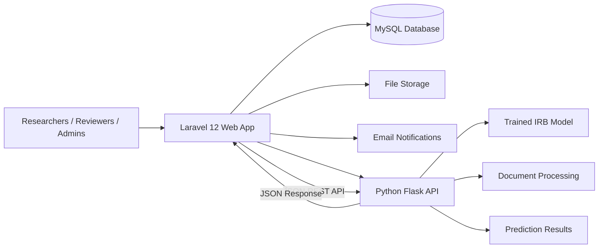

<p align="center">
  
</p>

<p align="center">
  
  
  
  
  
  
</p>

<h1 align="center">WMSU REO</h1>
<h3 align="center">Research Ethics Oversight Committee Portal</h3>

<p align="center">
  A unified digital platform for managing the complete lifecycle of research ethics review at Western Mindanao State University — from proposal submission through committee evaluation to clearance certification.
</p>

<p align="center">
  
  
  
  
</p>

---

## Overview

**WMSU REO** replaces fragmented paper submissions and ad-hoc email communications with a centralized workflow engine that guarantees statutory compliance with Philippine Health Research Ethics Board (PHREB) standards.

The system connects researchers, reviewers, administrators, and super-admins in one platform for:

- Research proposal submission with supporting documents
- Document verification and completeness triage
- Reviewer assignment based on expertise and college affiliation
- Appointment scheduling and meeting management
- Structured feedback, revision tracking, and decision history
- Automated email notifications at every critical stage
- AI-assisted preliminary classification using machine learning

---

## Features

### Researcher Portal
- Submit research titles with descriptions and category selection
- Upload required supporting documents (protocols, consent forms, CVs)
- Track proposal progress through each review stage
- Receive and respond to reviewer feedback and revision requests

### Reviewer Portal
- Review assigned submissions with integrated document viewer
- Submit structured remarks and recommendations per file
- Track review history and monitor revision cycles
- Communicate through the built-in feedback system

### Admin Dashboard
- Conduct initial completeness triage on incoming submissions
- Assign qualified reviewers to protocols
- Manage review cycles, deadlines, and appointments
- Generate official clearance certificates and recommendation letters
- Publish announcements, guidelines, and FAQs via built-in CMS

### Super-Admin Controls
- Manage all users, roles, and reviewer pools
- Configure review fee structures
- View institutional analytics and submission metrics
- Oversee system-wide settings and access controls

### AI Decision Support
- Trained IRB classification model for preliminary risk assessment
- Accepts extracted document text for automated analysis
- Returns predicted review type and approval probability
- Assists reviewers with initial screening to reduce turnaround time

---

## Technology Stack

### Backend
<p>
  
  
  
  
</p>

### Frontend
<p>
  
  
  
  
  
</p>

### AI / Machine Learning
<p>
  
  
  
  
</p>

### Document Processing
<p>
  
  
  
  
  
</p>

---

## Architecture

The application uses a **dual-backend architecture**: a Laravel web application handles business logic and user-facing workflows, while a separate Python/Flask microservice provides AI-powered classification and document analysis.



---

## Getting Started

### Prerequisites
- PHP 8.2+
- Composer
- Node.js 18+ & npm
- MySQL 8.x
- Python 3.x (for the ML microservice)

### Installation

```bash
# Clone the repository
git clone https://github.com/winston21587/REO.git
cd REO

# Install PHP dependencies
composer install

# Install frontend dependencies
npm install

# Configure environment
cp .env.example .env
php artisan key:generate

# Run database migrations
php artisan migrate

# Build frontend assets
npm run build

# Start the development server
php artisan serve
```

### AI Microservice (Optional)

```bash
# Navigate to the Python service directory
cd python-ml

# Install dependencies
pip install -r requirements.txt

# Start the Flask API
python app.py
```

---

## License

This project is licensed under the [MIT License](LICENSE).
